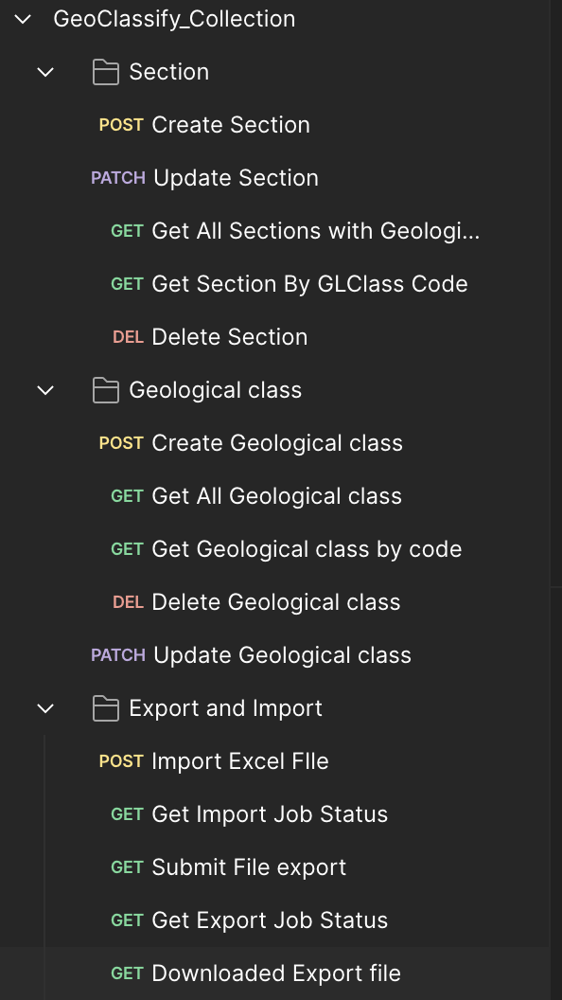
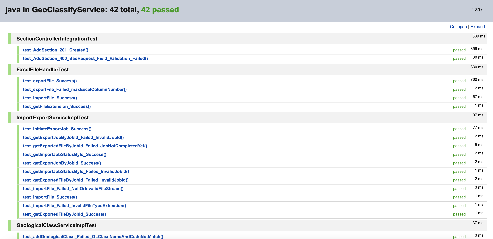
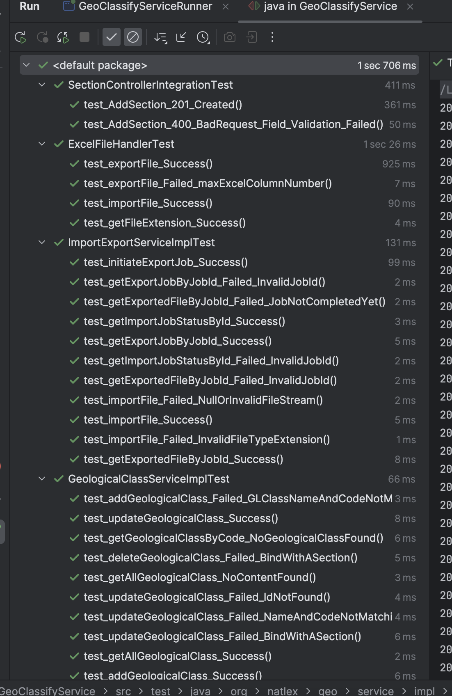

# GeoClassifyService

## Overview

A Spring boot application to manage sections and related geological class and all the operations via REST APIs.

## Tech Stack
Java 21 , Spring boot 3 , H2 , Data JPA , Docker , Apache POI , Swagger 3 ,  Unit and Integration tests

Swagger Documentation - http://localhost:8080/swagger-ui/index.html

Postman collection

## Some of Screenshots related to testing

Unit tessting

